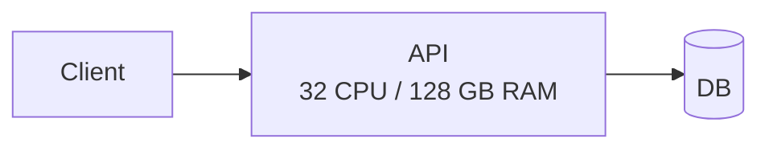
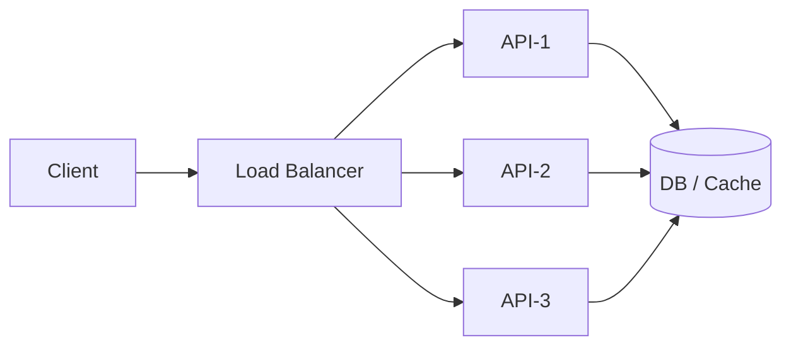
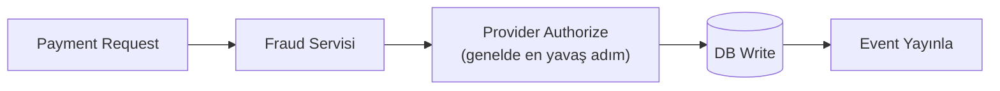
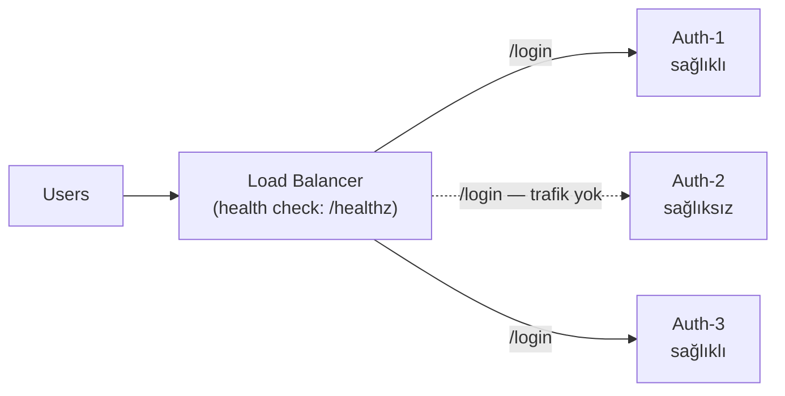
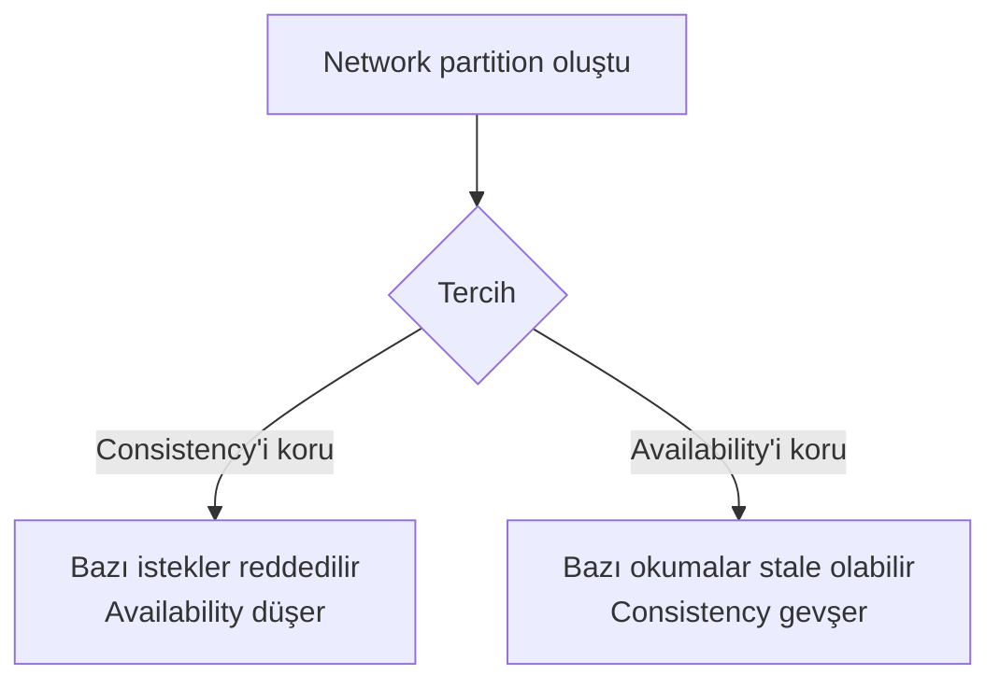

 
System design, sadece bir endpoint'i çalıştırmak değil, artan trafik, hata senaryoları, gecikme (latency), veri tutarlılığı, operasyon maliyeti ve ekip ölçeği altında sistemin davranışını tasarlamaktır.
 
> Bu yazıda ele alınanlar: scalability (vertical/horizontal), load balancing stratejileri, caching ve invalidation, SQL vs NoSQL kararı, CAP teoremi ve consistency/availability trade-off'ları — hepsi gerçek dünya (ödeme/auth sistemi) örnekleriyle.
{: .prompt-info }
 
## System design gerçek hayatta ne demek?
 
Pratikte system design, şu sorulara verilen mühendislik cevaplarının toplamıdır:
 
- Trafik 10x artarsa sistem nerede kırılır?
- Bir bileşen düşerse kullanıcı ne görür?
- Veri ne kadar hızlı "doğru" olmak zorunda?
- Gecikme mi daha kritik, doğruluk mu?
- Hangi noktada para harcayıp hangi noktada karmaşıklık azaltılmalı?
Örneğin ödeme sisteminde "ödeme iki kere çekilmemeli" gereksinimi, doğrudan idempotency, transaction sınırları, retry politikası ve güçlü gözlemlenebilirlik (logging/metrics/tracing) kararlarına dönüşür. Auth sisteminde ise "login hızlı olsun" tek başına hedef değildir; brute-force'a dayanıklılık, token yaşam döngüsü, session invalidation gibi konular da tasarımın parçasıdır.
 
## 1. Scalability: büyütmek sadece daha güçlü sunucu almak değildir
 
### Vertical vs Horizontal
 
#### Vertical scaling (scale-up)
 

 
- Daha fazla CPU/RAM olan tek makineye geçersin.
- Uygulaması basit, kısa vadede hızlı çözüm.
- Limit: fiziksel tavan ve tek hata noktası (single point of failure).

#### Horizontal scaling (scale-out)
 

 
- Aynı servisten birden fazla instance çalıştırırsın.
- Daha yüksek tavan, daha iyi dayanıklılık.
- Zorluk: state yönetimi, koordinasyon, dağıtık sistem karmaşıklığı.

### Bottleneck analizi
 
Çoğu sistemde darboğaz kod değil, bağımlılıklardır:
 
- DB connection pool dolması
- Yavaş dış servis çağrıları (ör. ödeme sağlayıcı API)
- Disk I/O veya network sınırları
- Sıralı çalışan kritik path'ler
Fintech-benzeri bir ödeme akışında sık pattern:
 

 
Burada latency çoğunlukla **Fraud servisi** ve **Provider Authorize** adımlarında birikir. API sunucusunu büyütmek tek başına sorunu çözmez.
 
### Stateless service neden önemli?
 
Horizontal scaling için servislerin mümkün olduğunca **stateless** olması gerekir. Yani instance üzerinde kullanıcıya özel oturum bilgisi tutmamak.
 
- Session state'i Redis gibi paylaşımlı bir katmana al
- JWT gibi taşınabilir kimlik yapıları kullan
- Dosya upload gibi işlemlerde local disk yerine object storage kullan
  
Aksi halde load balancer arkasında "sticky session" bağımlılığı doğar ve ölçekleme esnekliği azalır.
 
## 2. Load balancing: trafik dağıtımı değil, risk dağıtımı
 
Load balancer'ın temel rolü gelen trafiği instance'lara dağıtmaktır ama etkisi bundan büyüktür:
 
- Tek instance arızasında tüm sistemin düşmesini engeller
- Rolling deployment sırasında kesintiyi azaltır
- Health check ile bozuk node'u havuzdan çıkarır

Yaygın stratejiler:
 
- **Round-robin:** sırayla dağıtır, basit ve etkili.
- **Least connections:** aktif bağlantısı az olana gönderir.
- **IP hash / consistent hash:** aynı istemciyi aynı node'a yaklaştırır (cache locality için faydalı olabilir).
- **Weighted:** güçlü node'a daha fazla trafik verir.
Örnek (auth API):
 

 
Neden kritik? Çünkü production'da hata çoğu zaman "tam çöküş" değil, "kademeli bozulma"dır. LB olmadan bir node yavaşladığında herkes etkilenir; LB ile etki izole edilir.
 
## 3. Caching: hızlı sistemlerin gizli motoru, en zor bug'ların kaynağı
 
Read-heavy sistemlerde cache çoğu zaman en yüksek ROI'ye sahip optimizasyondur.
 
Örnekler:
 
- Auth sisteminde public key bilgisi
- Payment dashboard'da sık okunan işlem özetleri
- Referans veriler (ülke, para birimi, komisyon tabloları)

### Ne zaman cache kullanılır?
 
- Okuma, yazmadan belirgin şekilde fazlaysa
- Verinin kısa süre stale olması kabul edilebiliyorsa
- DB üzerindeki yük kritik seviyedeyse

### Temel stratejiler
 
- **Cache-aside (lazy loading):** miss olursa DB'den al, cache'e yaz.
- **Write-through:** DB'ye yazarken cache'i de güncelle.
- **Write-behind:** önce cache, arkadan asenkron DB (karmaşık ama yüksek throughput).

### Cache invalidation neden zor?
 
> "Bilgisayar biliminde iki zor problem vardır: cache invalidation ve isimlendirme." Şaka gibi dursa da pratikte gerçek bir problem.
{: .prompt-tip }
 
Sık problemler:
 
- Güncellenen veri cache'de eski kalır (stale read)
- Aynı key'e farklı versiyonlar yazılır
- TTL çok uzun seçilir, yanlış veri uzun süre yaşar
- TTL çok kısa seçilir, cache etkisi kaybolur

Pratik yaklaşım:
 
| Veri tipi       | Örnek                   | TTL stratejisi                                       |
| --------------- | ----------------------- | ---------------------------------------------------- |
| Doğruluk kritik | Kullanılabilir bakiye   | Kısa TTL + event ile invalidation + fallback DB read |
| Doğruluk esnek  | Rapor / dashboard kartı | Daha uzun TTL + eventual update                      |
 
> Ödeme sisteminde "kullanılabilir bakiye" ekranını cache'lemek caziptir; ama ledger güncellemesi sonrası invalidation güvenilir değilse kullanıcıya yanlış bakiye gösterebilirsin. Bu bir UX problemi değil, **finansal risk problemidir**.
{: .prompt-danger }
 
## 4. Databases: SQL vs NoSQL bir dogma değil, workload kararıdır
 
### SQL (PostgreSQL, MySQL vb.)
 
Güçlü taraflar:
 
- ACID transaction
- Güçlü tutarlılık
- Join ve kompleks sorgularda olgun ekosistem

Zayıf taraflar:
 
- Çok yüksek yazma işlem hacmi (write throughput) ve yatay bölümleme (horizontal partitioning) gerektiren senaryolarda yönetim zorlaşabilir
- Şema değişiklikleri dikkat ister

### NoSQL (MongoDB, Cassandra, DynamoDB vb.)
 
Güçlü taraflar:
 
- Esnek şema (ürüne hızlı iterasyon)
- Bazı türlerde yüksek ölçeklenebilirlik ve düşük latency
- Dağıtık mimariye doğal uyum

Zayıf taraflar:
 
- Join/transaction kapasitesi teknolojiye göre kısıtlı olabilir
- Veri modelleme hataları daha geç fark edilir
- Nihai tutarlılık (Eventually consistent) davranış uygulama seviyesinde ek dikkat gerektirir

### Pratik seçim modeli
 
| Veri tipi                | Örnek                             | Tercih                          |
| ------------------------ | --------------------------------- | ------------------------------- |
| Parasal kayıtlar         | Ödeme, muhasebe, bakiye, transfer | SQL ağırlıklı                   |
| Yüksek hacimli event/log | Activity feed, audit log          | NoSQL / append-friendly storage |
 
Gerçek sistemlerde hibrit yaklaşım yaygındır: kritik parasal kayıtlar relational DB'de, analitik ve event akışı farklı bir datastore'da tutulur.
 
## 5. CAP theorem: kısa ama pratik bakış
 
CAP teoremi, dağıtık bir sistemde ağ bölünmesi (network partition) varken aynı anda şu üçünü tam veremeyeceğini söyler:
 
- **Consistency (C):** Her okuma en güncel yazıyı görür.
- **Availability (A):** Her istek yanıt alır.
- **Partition tolerance (P):** Ağ bölünmelerine rağmen sistem çalışmaya devam eder.
Gerçek hayatta partition kaçınılmaz olduğu için çoğu üretim sistemi aslında **C ve A arasında** tercih yapar.
 

 
Bu yüzden "biz CP miyiz AP miyiz?" sorusu bileşen bazında sorulmalıdır; tüm sistem tek cevapla açıklanamaz.
 
## 6. Consistency vs Availability: pratik trade-off kararları
 
Her endpoint aynı tutarlılık seviyesini istemez.
 
#### Örnek 1: Payment
 
- Gereksinim: "Aynı işlem iki kez çekilmesin."
- Tercih: Daha güçlü consistency.
- Sonuç: Gerekirse kısa süreli availability kaybı kabul edilir (ör. retry/reject).

#### Örnek 2: Transaction listesi ekranı
 
- Gereksinim: Kullanıcı son 1-2 saniye gecikmeyi tolere edebilir.
- Tercih: Availability yüksek, eventual consistency kabul.

#### Örnek 3: Auth token doğrulama
 
- Gereksinim: Düşük latency + güvenlik.
- Tercih: Local doğrulama + key rotasyonu için kontrollü cache.
  
Karar çerçevesi:
 
1. Bu veri yanlışsa iş riski ne?
2. Kullanıcı gecikmeyi ne kadar tolere eder?
3. Hatanın geri dönüş maliyeti ne?
4. Operasyonel karmaşıklık bütçemiz ne kadar?

## Sık Yapılan Hatalar
 
1. **Teknolojiyi problemi çözmeden seçmek** — "NoSQL modern, onu kullanalım" yaklaşımı. Doğrusu: erişim paterni, tutarlılık ihtiyacı, operasyon maliyetiyle başla.
2. **Stateless prensibini atlamak** — Session'ı tekil sunucu belleğinde (instance memory) saklayıp sistemi yatayda büyütmeyi (scale-out) beklemek.
3. **Cache'i sadece performans feature'ı sanmak** — Invalidation planı olmadan cache eklemek.
4. **DB darboğazını uygulama katmanında gizlemek** — N+1 query, yanlış index, connection pool sınırlarını gözden kaçırmak.
5. **CAP ve consistency konularını siyah-beyaz düşünmek** — "Her şey strongly consistent olmalı" veya "eventual her yerde yeterli" uçları.
6. **Hata senaryosu tasarlamamak** — Dış servis timeout olduğunda sistemin nasıl davranacağını önceden modellememek.

## Özet
 
System design, mühendisliğin "kod çalışıyor mu" sorusundan "sistem baskı altında ne yapar" sorusuna geçtiği yerdir. Scalability, load balancing, caching, veritabanı seçimi ve CAP trade-off'ları aslında aynı sorunun farklı yüzleri: **hatayı nerede, nasıl ve ne maliyetle karşılayacağız?**
 
Bu yazıdaki örneklerin ortak noktası şu: doğru cevap teknolojide değil, gereksinimde saklı. Bakiye ekranı ile transaction listesi ekranının aynı tutarlılık seviyesini istememesi gibi, her sistem bileşeni kendi trade-off'unu hak ediyor. Happy path'i tasarlamak kolay kısım; asıl mühendislik, bir bileşen düştüğünde, gecikme arttığında veya veri geçici olarak yanlış olduğunda sistemin nasıl davranacağını önceden düşünmekte.
