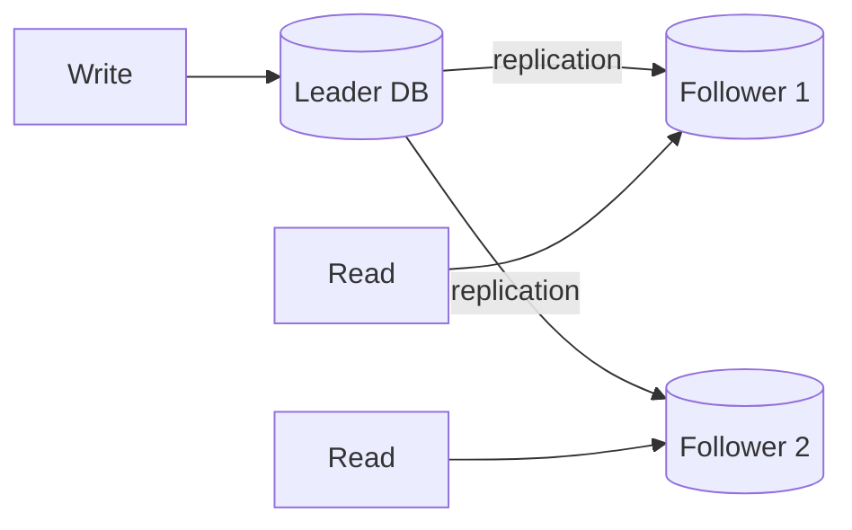
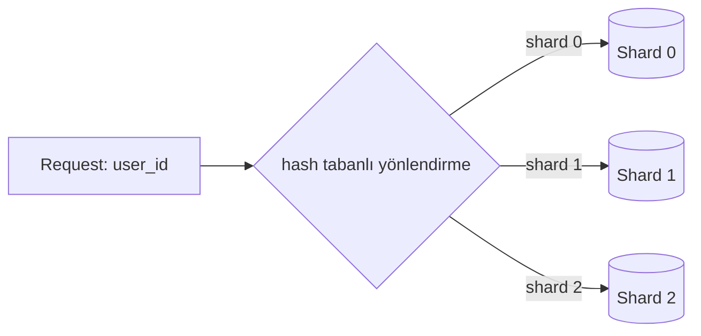
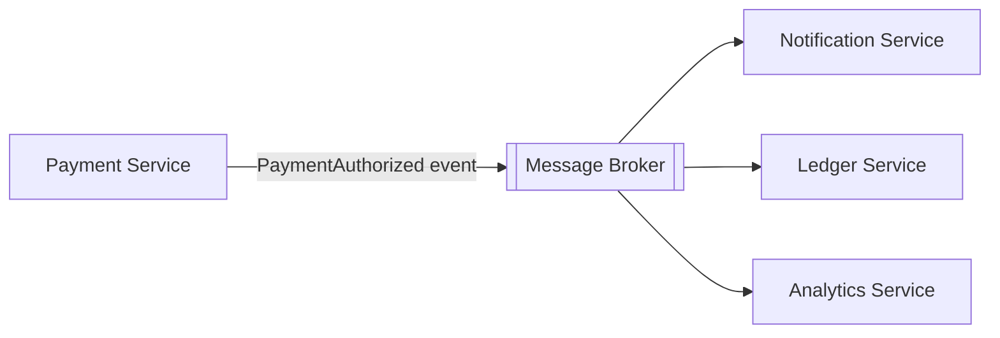
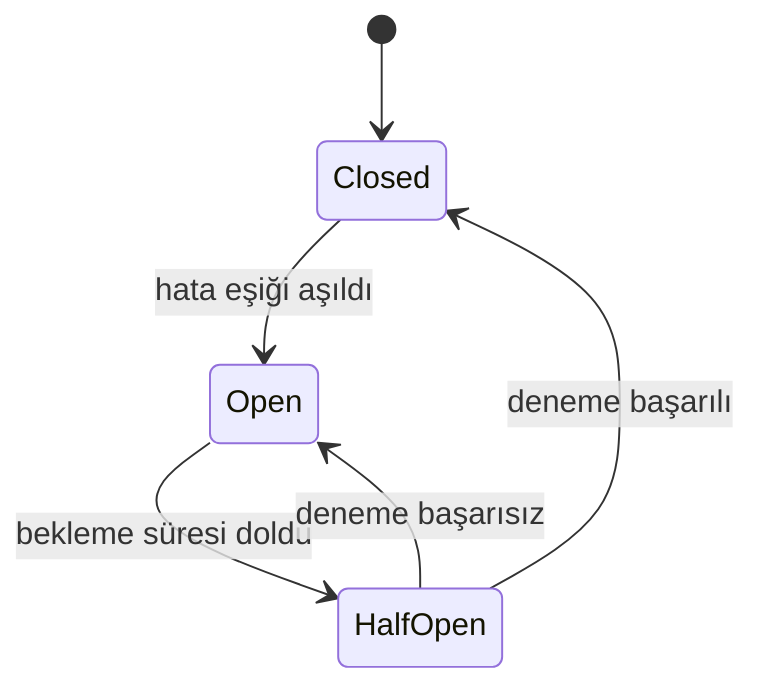

 
[System Design Notları – 1](https://klckerim.github.io/posts/system-design-notes-part-1/) yazısında tekil bir API'yi yatayda büyütmeyi, load balancer'ı ve cache'i ele almıştık. Ama gerçek sistemlerde asıl zorluk genelde iki yerde ortaya çıkar: **veritabanı katmanı** büyüdüğünde ve **senkron çağrı zincirleri** kırıldığında.
 
Bu yazıda üç konuya odaklanıyoruz: veritabanını nasıl büyütürüz (replication & sharding), senkron akışı nasıl asenkrona çeviririz (message queue) ve dağıtık sistemde bir bileşen patladığında nasıl davranırız (idempotency, retry, circuit breaker).
 
> Bu yazıda ele alınanlar: database replication (leader-follower, multi-leader, leaderless), sharding stratejileri, message queue / event-driven mimari, delivery guarantee'ler, idempotency, retry + backoff ve circuit breaker pattern'i.
{: .prompt-info }
 
## 1. Database Scaling: Replication
 
Tek bir DB instance'ı büyük veri hacmine ve okuma yüküne uzun süre dayanamaz. İlk çözüm genelde **replication**: aynı veriyi birden fazla node'da tutmak.
 
### Leader-Follower (Primary-Replica)
 

 
- Tüm yazılar leader'a gider, okumalar follower'lara dağıtılabilir.
- Okuma yükünü yatay olarak ölçekler, leader düşerse follower'lardan biri yeni leader olabilir (failover).
- Zayıf nokta: **replication lag**. Follower, leader'ın gerisinde kalabilir.
> Kullanıcı ödemeyi yaptı ve hemen ardından transaction listesini yeniledi. İstek bir follower'a gitti ve replication henüz tamamlanmadıysa kullanıcı kendi işlemini göremez ("read your own write" sorunu). Bu, Notes 1'deki consistency/availability trade-off'unun canlı bir örneği.
{: .prompt-warning }
 
### Multi-Leader ve Leaderless
 
- **Multi-Leader:** Birden fazla node yazı kabul eder (genelde multi-region senaryolarda). Yüksek yazma availability'si sağlar ama **conflict resolution** gerektirir — iki bölge aynı kaydı aynı anda güncellerse hangisi kazanır?
- **Leaderless (Dynamo tarzı, ör. Cassandra):** Sabit bir leader yoktur; yazma ve okuma **quorum** ile yapılır. N kopya arasından en az W tanesine yazıp en az R tanesinden veri okunursa ve `W + R > N` ise, okunan kopyalardan en az biri en güncel yazıyı içerir. N/W/R değerlerini ayarlayarak "hangi durumda ne kadar tutarlılık istiyorum" kararı verilir, bu da uygulama tarafında ek bir karmaşıklık demektir.

| Model           | Yazma availability       | Karmaşıklık                  | Tipik kullanım                         |
| --------------- | ------------------------ | ---------------------------- | -------------------------------------- |
| Leader-Follower | Orta (tek yazma noktası) | Düşük                        | Çoğu OLTP sistemi                      |
| Multi-Leader    | Yüksek                   | Yüksek (conflict resolution) | Multi-region yazma                     |
| Leaderless      | Yüksek                   | Orta-yüksek (quorum tuning)  | Yüksek yazma hacimli, esnek tutarlılık |
 
## 2. Database Scaling: Sharding / Partitioning
 
Replication okuma yükünü çözer ama **yazma** yükü ve **veri hacmi** büyüdükçe tek node yetmez. Çözüm: veriyi parçalara (shard) bölmek. En yaygın yöntemlerden biri, bir key'i (ör. `user_id`) hash'leyip `hash(user_id) mod N` sonucuna göre ilgili shard'a yönlendirmektir:
 

 
| Strateji                         | Artı                                      | Eksi                                                |
| -------------------------------- | ----------------------------------------- | --------------------------------------------------- |
| Range-based                      | Sıralı sorgular (ör. tarih aralığı) kolay | Hot range riski — yeni kayıtlar tek shard'a yığılır |
| Hash-based                       | Yük dengeli dağılır                       | Range query zorlaşır, resharding maliyetli          |
| Directory-based (lookup service) | Esnek, shard'lar arası taşıma kolay       | Lookup servisi kendisi tek hata noktası olabilir    |
 
İki pratik tuzak:
 
- **Hot partition:** Shard key'i yanlış seçilirse (ör. tüm büyük müşterileri tek shard'a düşüren bir key), o shard darboğaz olur.
- **Resharding acısı:** Shard sayısını değiştirmek veri taşımayı gerektirir. Notes 1'de load balancer için bahsettiğimiz **consistent hashing**, burada da devreye girer — shard sayısı değiştiğinde taşınması gereken veri miktarını azaltır.

## 3. Senkrondan Asenkrona: Message Queue & Event-Driven Mimari
 
Örnek ödeme akışı: `Fraud servisi → Provider authorize → DB write → Event yayınla`. Fraud kontrolü ve provider authorize adımları senkron kalmak zorunda, ödemenin onaylanıp onaylanmadığını bilmeden kullanıcıya cevap dönemeyiz. Bu ikisinin yavaşlaması veya hata vermesi ayrı bir problem; onu bir sonraki bölümdeki resilience pattern'leri (retry, circuit breaker) çözüyor.
 
Ama DB write'tan **sonraki** adımlar öyle değil. Notification, ledger güncellemesi, analytics; bunların hiçbiri kullanıcının cevabı beklemesini gerektirmez. Çözüm: bu adımları **message queue** üzerinden asenkrona almak.
 

 
- Payment servisi event'i yayınlar yayınlamaz kullanıcıya cevap döner.
- Notification, ledger, analytics servisleri kendi hızlarında, birbirinden bağımsız tüketir.
- Bir consumer (ör. analytics) yavaşlasa veya düşse bile ana ödeme akışı etkilenmez.

### Delivery guarantee'ler
 
- **At-most-once:** Mesaj kaybolabilir ama asla iki kez işlenmez. Genelde kabul edilemez (ör. ödeme event'i kaybolursa ledger hiç güncellenmez).
- **At-least-once:** Mesaj en az bir kez işlenir ama duplicate gelebilir. **Pratikte varsayılan tercih budur.**
- **Exactly-once:** Teoride ideal, pratikte tam garantisi maliyetli/karmaşık; çoğu sistem aslında "at-least-once + idempotent consumer" ile exactly-once *etkisi* yaratır.
> At-least-once'u varsayılan seçtiysek, her consumer'ın aynı event'i iki kez işlese bile yan etkiyi tekrarlamaması gerekir. Bu tam olarak bir sonraki bölümün konusu: idempotency.
{: .prompt-tip }
 
## 4. Resilience Patterns: Idempotency, Retry, Circuit Breaker
 
"Ödeme iki kere çekilmemeli" gereksinimini gerçekten sağlayan şey tek bir teknoloji değil, üç pattern'in birlikte çalışmasıdır.
 
### Idempotency
 
Client aynı isteği (network timeout, retry, kullanıcı çift tıklama vb. yüzünden) birden fazla gönderebilir. Sunucu bunu güvenle karşılayabilmeli.
 
**Idempotency key** akışı:
 
1. Client, her mantıksal işlem için benzersiz bir key üretir: `Idempotency-Key: abc123`
2. Sunucu bu key'i daha önce gördü mü diye kontrol eder.
3. Görmediyse işlemi yapar ve sonucu key ile birlikte saklar.
4. Client timeout sonrası aynı key ile retry atarsa, sunucu işlemi tekrar çalıştırmaz — saklanan sonucu döner.
Bu pattern olmadan retry eklemek, tam olarak önlemeye çalıştığımız hatayı üretir.
 
### Retry + Exponential Backoff + Jitter
 
- Düz retry (sabit aralıklarla) tehlikelidir: bir servis kısa süreli yavaşladığında tüm client'lar aynı anda tekrar dener → **thundering herd** / retry storm, servisi daha da çökertir.
- **Exponential backoff:** Her denemede bekleme süresini katlayarak artır (1s, 2s, 4s, 8s...).
- **Jitter:** Bekleme süresine rastgelelik ekle, client'ların aynı anda vurmasını engelle.

### Circuit Breaker
 
Downstream servis (ör. ödeme sağlayıcı) sürekli hata veriyorsa, ona istek göndermeye devam etmek hem senin sistemini hem de zaten zorlanan servisi daha kötü duruma sokar.
 

 
- **Closed:** İstekler normal akar, hata oranı izlenir.
- **Open:** Eşik aşıldığında istekler downstream'e hiç gitmez, hemen hata/fallback döner.
- **Half-Open:** Belirli bir süre sonra az sayıda deneme yapılır; başarılıysa Closed'a döner, başarısızsa tekrar Open'a geçer.
> Retry, idempotency olmadan güvenli değildir; circuit breaker da retry'ı sınırlamadan yeterli değildir. Üçü birlikte düşünülmeli — biri eksikse diğer ikisi de yarım iş görür.
{: .prompt-danger }
 
## Sık Yapılan Hatalar
 
1. **Retry eklerken idempotency'i unutmak** — duplicate side effect (ör. çift ödeme çekimi) ile sonuçlanır.
2. **Backoff'ta jitter kullanmamak** — retry'lar senkronize kalır, thundering herd riski devam eder.
3. **Message queue'yu "sihirli tutarlılık" sanmak** — varsayılan at-least-once'tur, consumer idempotent olmak zorundadır.
4. **Shard key'i sorgu paternine göre seçmemek** — hot shard oluşur, cross-shard join ihtiyacı patlar.
5. **Circuit breaker'ı sadece HTTP çağrılarına uygulayıp DB/queue bağlantılarını atlamak** — darboğaz sadece dış API'lerde olmuyor.
6. **Replication lag'i yok saymak** — "read your own write" senaryolarını test etmeden production'a çıkmak.

## Özet
 
 Bu yazı "hangi tutarlılık seviyesini istiyorum" sorusuna; **veri katmanında** (replication, sharding) ve **çağrı zincirinde** (queue, idempotency, circuit breaker) nasıl cevap verileceğini ekliyor.
 
Ortak tema aynı: hiçbir pattern tek başına yeterli değil. Replication okuma yükünü çözer ama lag getirir; sharding yazma yükünü çözer ama resharding acıtır; queue senkron zinciri gevşetir ama duplicate işlem riski getirir; retry bunu idempotency olmadan güvenli hale getirmez. Bu pattern'leri tek tek bilmek tek başına yeterli değil, hangi ikisinin birbirini tamamladığını görmek önemli. 
