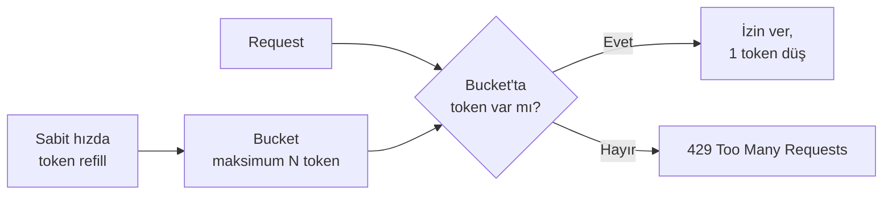
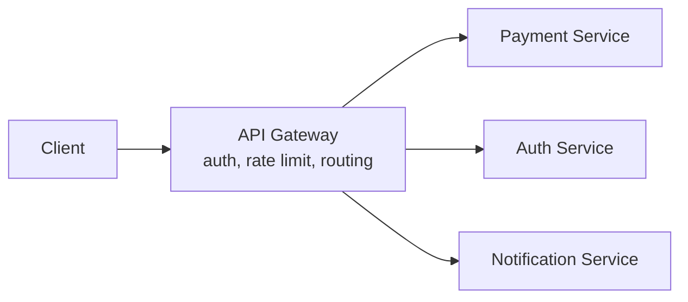
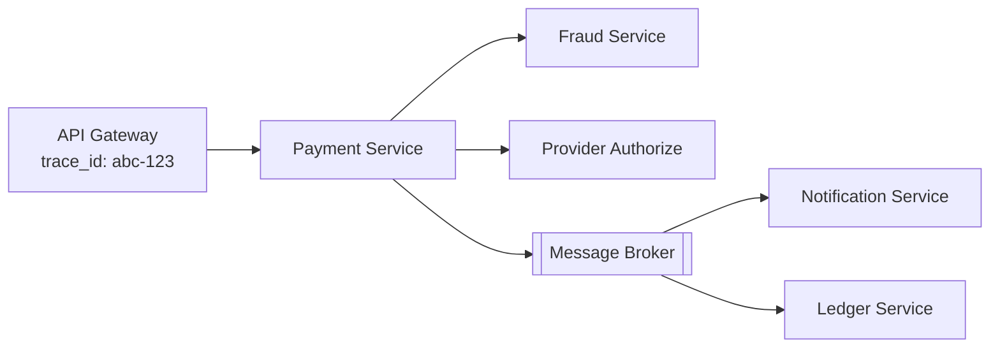

 
[System Design Notları – 2](https://klckerim.github.io/posts/system-design-notes-part-2/)  yazısında bir isteğin dayanıklılığını ele almıştık: idempotency, retry, circuit breaker. Ama dayanıklılık tek bir isteği kurtarır. Sistemi trafiğin kendisinden korumak ve o trafiğin sistemde nereye gittiğini görebilmek ayrı bir problem.
 
Bu yazıda üç konuya odaklanıyoruz: trafiği en baştan sınırlamak (rate limiting), cross-cutting concern'leri tek noktada toplamak (API Gateway) ve dağıtık sistemi görünür kılmak (observability: logging, metrics, tracing).
 
> Bu yazıda ele alınanlar: rate limiting algoritmaları (fixed window, sliding window, token bucket, leaky bucket), dağıtık rate limiting problemi, API Gateway'in rolü, observability'nin üç sacayağı (logging/metrics/tracing) ve correlation ID pattern'i.
{: .prompt-info }
 
## 1. Rate Limiting: trafiği en baştan sınırlamak
 
Circuit breaker reaktiftir, veri akışı zaten patladıktan sonra devreye girer. Rate limiting proaktiftir: sistemin kaldıramayacağı trafiği en baştan reddeder. İkisi birlikte çalışır, biri diğerinin yerini tutmaz.
 
### Algoritmalar
 
| Algoritma              | Nasıl çalışır                                                     | Zayıf nokta                                                                                                       |
| ---------------------- | ----------------------------------------------------------------- | ----------------------------------------------------------------------------------------------------------------- |
| Fixed window counter   | Sabit zaman diliminde (ör. her dakika) sayaç tutar                | Pencere sınırında burst'e izin verebilir, 11:59:59'da N istek, 12:00:01'de N istek daha, aynı 2 saniyede 2N istek |
| Sliding window log     | Her isteğin timestamp'ini tutar, pencereyi kayar şekilde hesaplar | Doğru ama yüksek memory maliyeti                                                                                  |
| Sliding window counter | Önceki ve şimdiki pencerenin ağırlıklı ortalamasını alır          | Fixed window'a göre daha doğru, tam sliding log kadar pahalı değil, pratikte en dengeli seçim                     |
| Token bucket           | Bucket sabit hızda dolar, her istek bir token tüketir             | Bucket doluyken burst'e izin verir                                                                                |
| Leaky bucket           | İstekler sabit hızda "sızdırılarak" işlenir                       | Burst'e izin vermez, ani trafiği geciktirir                                                                       |
 
Token bucket ve leaky bucket sık karıştırılır. Fark şu: **token bucket kısa süreli burst'e izin verir** (bucket doluysa aniden gelen 50 istek anında geçer), **leaky bucket burst'ü asla geçirmez** (ne kadar istek birikirse biriksin, çıkış hızı sabittir). Kullanıcı deneyimi öncelikliyse (ör. API client'ların ara sıra patlama yapmasına izin ver) token bucket; downstream'i sabit hızda beslemek önceliliyse (ör. bir batch processing hattı) leaky bucket daha uygun.
 

 
### Dağıtık rate limiting problemi
 
Stateless servislerin session state'ini Redis gibi paylaşımlı bir katmana alması gerektiğini söylemiştik. Rate limit sayacı da aynı sorunu yaşar.
 
> Her API instance kendi memory'sinde sayaç tutarsa, N instance arkasında gerçek limit "sınır" değil, "sınır × N" olur. LB trafiği round-robin dağıttığı için bu production'a çıkana kadar fark edilmeyebilir.
{: .prompt-warning }
 
Doğru yaklaşım: sayacı Redis gibi paylaşımlı bir store'da tutmak (ör. `INCR` + `EXPIRE` kombinasyonu, ya da sliding window için sorted set). Bu, tek bir network round-trip'i ekler ama tüm instance'lar arasında tutarlı bir limit sağlar.
 
Nerede uygulanacağı da ayrı bir karar: her serviste ayrı ayrı mı, yoksa tek bir merkezi noktada mı? Bu bizi bir sonraki konuya getiriyor.
 
## 2. API Gateway: cross-cutting concern'leri tek noktada toplamak
 
Her servise ayrı ayrı auth, rate limiting, logging eklemek hem tekrar hem de tutarsızlık riski demektir. API Gateway bu concern'leri tek bir giriş noktasında toplar.
 

 
Tipik sorumluluklar:
 
- **Authentication:** Token'ı bir kere doğrula, arkadaki servisler tekrar doğrulamak zorunda kalmasın.
- **Rate limiting:** Merkezi enforcement noktası, dağıtık sayaç problemini tek bir yerde çöz.
- **Routing:** İsteği doğru servise yönlendir, versiyon/path bazlı yönlendirme yap.
- **TLS termination, request/response transformation.**
- **Log/metrik toplama noktası:** Her isteğin sisteme girdiği yer, bir sonraki bölümdeki correlation ID'nin doğal doğum yeri.

> Gateway'e iş kuralı sızdırmak yaygın bir hatadır, "burada zaten kullanıcı bilgisi var, şu kontrolü de burada yapalım" diye başlar. Gateway routing + cross-cutting concern katmanı olarak kalmalı; iş mantığı servislerde durmalı. Aksi halde gateway bir "god object"e dönüşür ve servisler arası bağımlılık görünmez hale gelir.
{: .prompt-danger }
 
Gateway'in kendisi de bir servis, horizontal scaling ve stateless prensipleri ona da uygulanır. Tek bir gateway instance'ı tüm trafiğin tek hata noktası olmamalı.
 
## 3. Observability: dağıtık sistemi görünür kılmak
 
Örnek ödeme akışı: Gateway → Payment → Fraud → Provider → DB → Queue → Notification/Ledger/Analytics. Bir istek artık tek bir process'te değil, yedi farklı bileşende yaşıyor. Bir şey yavaşladığında "nerede?" sorusuna cevap vermek, doğru araçlar olmadan neredeyse imkansız.
 
Üç sacayağı:
 
| Sacayağı | Hangi soruya cevap verir                      | Araç örnekleri                |
| -------- | --------------------------------------------- | ----------------------------- |
| Logging  | Ne oldu? (olay bazlı detay)                   | ELK, Loki                     |
| Metrics  | Ne kadar, ne sıklıkta? (zaman içindeki trend) | Prometheus, Grafana           |
| Tracing  | İstek nerede yavaşladı? (uçtan uca yolculuk)  | Jaeger, Zipkin, OpenTelemetry |
 
### Logging
 
- Serbest metin yerine **structured log** (JSON) kullan, sonradan sorgulanabilir olması gerekir.
- Her log satırında request/trace ID bulunmalı.
- PII ve secret'ları loglama, "detaylı log" iyi niyetle atılır ama audit/compliance riski yaratır.

### Metrics
 
- **RED method** (servisler için): Rate, Errors, Duration.
- **USE method** (kaynaklar için): Utilization, Saturation, Errors.
- Counter (sadece artan), gauge (anlık değer), histogram (dağılım, ör. p50/p95/p99 latency); p99'u atlayıp sadece ortalamaya bakmak yaygın bir hatadır, ortalama iyi görünse de kullanıcıların %1'i çok kötü bir deneyim yaşıyor olabilir.

### Tracing ve correlation ID
 
Gateway'de üretilen bir `trace_id`, isteğin geçtiği her servise (HTTP header ile) ve her mesaj kuyruğuna (mesaj metadata'sı ile) taşınır. Her adım kendi **span**'ini bu trace_id altında kaydeder, başlama zamanı, bitiş zamanı, süre.
 

 
> Correlation ID eklenmezse, production'da beş servisi geçen bir isteğin tam olarak nerede yavaşladığını bulmak günler sürebilir, her servisin logunu zaman damgasına göre elle eşleştirmek zorunda kalırız.
{: .prompt-tip }
 
Bir trade-off var: yüksek QPS'te her isteği %100 trace etmek maliyetli (storage + network overhead). Pratik yaklaşım: normal trafiği düşük oranda örnekleyip (ör. %1-5), ama hataları ve yavaş istekleri (ör. p95 üstü) her zaman %100 trace etmek. Hiç sample yapmadan sadece hataları loglamak da yeterli değil, normal isteklerin latency dağılımını göremeyiz, sorunun ne zaman başladığını geriye dönük tespit edemeyiz.
 
## Sık Yapılan Hatalar
 
1. **Rate limit sayacını instance-local tutmak**; dağıtık ortamda gerçek limit instance sayısıyla çarpılır, production'a kadar fark edilmez.
2. **Fixed window counter kullanıp burst sorununu görmezden gelmek**; window sınırında beklenenin iki katı trafiğe izin verilebilir.
3. **API Gateway'e iş mantığı sızdırmak**; gateway zamanla bir "god object"e dönüşür, servisler arası gerçek bağımlılık görünmez hale gelir.
4. **Correlation ID'yi sadece HTTP çağrılarında taşımak**; message queue mesajlarına eklemeyi unutmak, async akışta trace'in kaybolmasına yol açar.
5. **Trace sampling'i yanlış ayarlamak**; %100 sampling maliyeti patlatır, hiç sampling yapmamak (sadece error loglamak) normal trafiğin latency dağılımını görünmez kılar.
6. **Sadece ortalama latency'ye bakmak**; p99'u izlemeden "sistem hızlı" sanmak, kullanıcıların bir kısmı çok kötü bir deneyim yaşıyor olabilir.

## Özet
 
Trafiği en baştan kontrol altına almak (rate limiting, API Gateway) ve sistemi, bir şey ters gittiğinde gerçekten görebilmek (logging, metrics, tracing) kritiktir.
 
Hiçbir katman tek başına yeterli değil. Rate limiting olmadan circuit breaker'a çok geç kalırız; API Gateway olmadan her serviste aynı auth/rate-limit kodu tekrarlanır; observability olmadan diğer her şey ne kadar iyi tasarlanmış olursa olsun, production'da neyin bozulduğunu göremezsek anlamsız kalır. 
