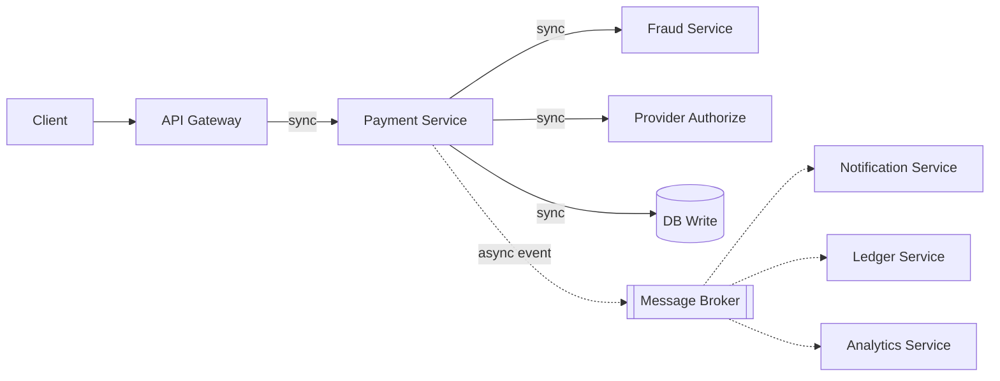
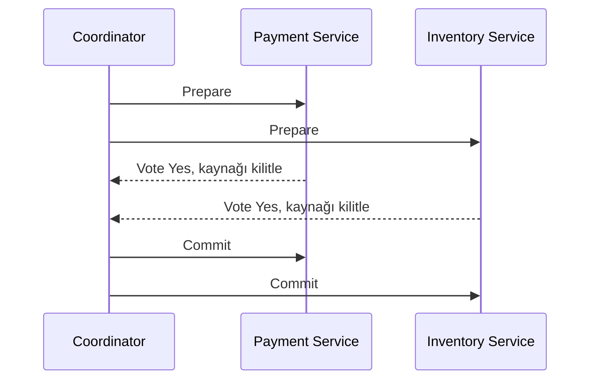
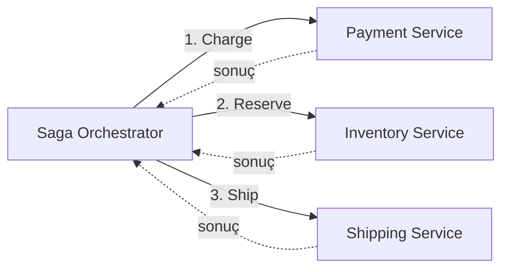

 
Sistem birden fazla servise bölündüğünde iki yeni soru ortaya çıkar: servisler birbiriyle nasıl konuşacak, ve birden fazla servisi ilgilendiren bir işlem yarıda kalırsa ne olacak?

Bu yazıda üç konuya odaklanıyoruz: servisler birbiriyle nasıl konuşmalı (sync vs async), birden fazla servisi ilgilendiren bir işlem yarıda kalırsa ne olur (2PC, Saga pattern) ve en başta bu servisleri nereden böldüğümüz (service boundary tasarımı).
 
> Bu yazıda ele alınanlar: sync (REST/gRPC) vs async iletişim, Two-Phase Commit ve neden mikroservislerde az kullanıldığı, Saga pattern (choreography vs orchestration), compensating transaction ve servis sınırlarını çizerken kullanılacak pratik kriterler.
{: .prompt-info }
 
## 1. Servisler Nasıl Konuşur: Sync vs Async
 
### Sync tarafında bir seçim daha var: REST mi, gRPC mi?
 
- **REST (JSON/HTTP):** İnsan tarafından okunabilir, geniş tooling desteği, debug etmesi kolay. Public API'ler ve dış entegrasyonlar için doğal seçim.
- **gRPC (Protobuf/HTTP2):** Binary serialization, daha düşük latency, sıkı contract (proto dosyası), native streaming desteği. İç servisler arası iletişimde performans avantajı gerçek bir kazanca dönüşür.

Kural şu: dışa açık API'de REST, iç servisler arası yüksek hacimli iletişimde gRPC. İkisini karıştırmak (gateway'de REST, arkada gRPC) yaygın ve makul bir pattern.
 
### Ne zaman sync, ne zaman async?
 
| Soru                                 | Sync (REST/gRPC)                 | Async (Message Queue)           |
| ------------------------------------ | -------------------------------- | ------------------------------- |
| Caller sonucu hemen bilmeli mi?      | Evet                             | Hayır                           |
| Downstream yavaşlar/düşerse ne olur? | Caller da bekler ya da hata alır | Kuyruğa alınır, sonra işlenir   |
| Coupling seviyesi                    | Yüksek, aynı SLA'yı paylaşırlar  | Düşük, bağımsız ölçeklenir      |
| Debug edilebilirlik                  | Kolay, tek istek-cevap           | Zor, tracing şart               |
| Tipik kullanım                       | Fraud check, provider authorize  | Notification, ledger, analytics |
 
Örnek ödeme akışı diyagramı:
 

 
Düz çizgiler sync, kesikli çizgiler async. Ödemenin onaylanıp onaylanmadığını belirleyen kısım (fraud, provider, DB write) senkron kalmak zorunda, kullanıcı cevabı bekliyor. Sonucu etkilemeyen kısım (notification, ledger, analytics) asenkron.
 
## 2. Dağıtık Transaction'lar: 2PC ve neden az kullanılır
 
Birden fazla servisi ilgilendiren bir işlemin "ya hep ya hiç" olması gerekiyorsa (ör. ödeme çekilsin VE stok rezerve edilsin, ikisi birden ya da hiçbiri), klasik çözüm **Two-Phase Commit (2PC)**.
 

 
- **Prepare fazı:** Coordinator herkese sorar, herkes kaynağı kilitler ve oy verir.
- **Commit fazı:** Herkes "evet" dediyse coordinator commit emri verir; biri "hayır" derse herkese abort emri verir.

> Coordinator, tüm taraflar "evet" dedikten sonra ama commit emri gönderemeden çökerse, katılımcılar kilidi ne zaman bırakacaklarını bilemez, kaynaklar süresiz kilitli kalabilir. Bu yüzden 2PC **blocking** bir protokoldür ve coordinator tek hata noktasıdır.
{: .prompt-danger }
 
CAP teoremiyle doğrudan bağlantılı: 2PC consistency'yi garanti etmek için availability'den taviz verir, coordinator veya herhangi bir katılımcı partition'a uğradığında sistem kilitlenir, cevap vermez. Çoğu mikroservis mimarisi bu trade-off'u kabul edemez; bu yüzden 2PC pratikte tek bir veritabanı içindeki transaction'larla sınırlı kalır, servisler arası pek kullanılmaz.
 
## 3. Saga Pattern: 2PC'nin pratik alternatifi
 
Saga, tek bir büyük transaction yerine, her biri kendi local transaction'ı olan bir adım zinciri kurar. Bir adım başarısız olursa, önceki adımlar **compensating transaction** ile geri alınır, kilitleme yok, geri alma var.
 
Sipariş akışı örneği (ödemenin, aslında daha büyük bir Saga'nın tek adımı olduğunu düşün):
 
| Adım    | Local transaction      | Compensating transaction |
| ------- | ---------------------- | ------------------------ |
| Payment | Ödeme çek              | Ödemeyi iade et          |
| Stok    | Stok rezerve et        | Rezervasyonu bırak       |
| Kargo   | Gönderi talebi oluştur | Gönderiyi iptal et       |
 
İki koordinasyon şekli var.
 
### Choreography: merkezi koordinatör yok
 

 
Her servis bir event dinler, kendi işini yapar, bir sonraki event'i yayınlar. (Diyagramda her ok aslında bir event yayınlama + dinlemeyi temsil ediyor.)
 
### Orchestration: merkezi bir koordinatör var
 

 
Orchestrator her adımı açıkça tetikler ve sonucu bekler; bir adım başarısız olursa geri alma mantığını da o yönetir.
 
|                               | Choreography                                | Orchestration                        |
| ----------------------------- | ------------------------------------------- | ------------------------------------ |
| Coupling                      | Düşük, servisler sadece event'e tepki verir | Orta, servisler orchestrator'ı bilir |
| Akışı anlamak                 | Zor, mantık servislere dağılmış             | Kolay, mantık tek yerde              |
| Yeni adım eklemek             | Kolay, yeni bir event listener              | Orchestrator'ı güncellemek gerekir   |
| Failure/compensation yönetimi | Her serviste ayrı ayrı                      | Merkezi, tek yerde                   |
 
Pratik kural: 2-3 adımlık basit bir akışta choreography yeterli ve daha az altyapı ister. 4+ servis ve karmaşık geri alma senaryoları varsa orchestration daha mantıklı, akışı tek yerden görebilmenin debug kolaylığı, ek altyapı maliyetine değer.
 
## 4. Servis Sınırlarını Çizmek
 
Buraya kadar servislerin var olduğunu ve birbiriyle konuştuğunu varsaydık. Asıl soru bir adım geride: bu servisleri nereden böldük, doğru mu böldük?
 
Tek pratik kriter: **bölünme nedeni veri değil, değişim hızı ve ekip sınırı olmalı.**
 
| İyi neden                                         | Kötü neden                                              |
| ------------------------------------------------- | ------------------------------------------------------- |
| Farklı scaling ihtiyacı (payment vs analytics)    | "Bu tablo farklı, ayrı servis olsun"                    |
| Farklı tutarlılık gereksinimi (CAP kararları)     | Organizasyon şeması öyle gerektiriyor diye              |
| Gerçek bir bağımsız deploy edilebilirlik ihtiyacı | "Herkes microservice yapıyor" trendi                    |
| Farklı ekip, farklı release hızı                  | Kod tabanı büyüdü diye, büyüklük tek başına neden değil |

> İki servis birbirini sürekli, gereksiz şekilde senkron çağırıyorsa (ör. A her isteğinde B'yi üç kere çağırıyor), muhtemelen aslında tek servis olmaları gerekiyordur. Bu **distributed monolith**, mikroservislerin tüm operasyonel karmaşıklığını taşır ama bağımsız deploy/scale edebilme avantajının hiçbirini alamaz.
{: .prompt-warning }
 
Sync/async kararı aslında burada da bir sinyal: bir "servis çifti" arasında sürekli sync çağrı gerekiyorsa, önce servis sınırı sorgulanmalı, çözüm her zaman message queue eklemek değildir.

## Sık Yapılan Hatalar

1. **Her şeyi sync REST ile bağlamak** - caller'ı gereksiz yere downstream'in availability'sine bağımlı kılmak.
2. **2PC'yi mikroservisler arası kullanmaya çalışmak** - coordinator crash'i sistemi kilitli tutabilir, CAP'in availability tarafından ciddi taviz verir.
3. **Saga'da compensating transaction yazmayı unutmak** - sadece mutlu yol (happy path) tasarlanır, geri alma senaryoları sonradan eklenmeye çalışılır.
4. **Choreography'i çok fazla servise yaymak** - akışı anlamak/debug etmek imkansızlaşır, "şu an sipariş nerede" sorusuna kimse cevap veremez.
5. **Servisleri veri modeline göre bölmek**, değişim hızına/ekip sınırına göre değil - distributed monolith'e yol açar.
6. **Gereksiz/karmaşık senkron çağrıları normal karşılamak** - aslında tek servis olması gereken şeyi ikiye bölmüş olabiliriz.

## Özet

Servislerin birbiriyle nasıl konuştuğunu (sync/async), bu konuşmanın tutarlılığını nasıl koruduğunu (2PC neden zor, Saga nasıl çözüyor) ve en temelde bu servisleri nereden böleceğimizi ele aldık.
 
Hiçbir karar izole değil. Sync/async seçimi servis sınırını etkiler; servis sınırı yanlışsa hiçbir iletişim pattern'i onu kurtarmaz; Saga, 2PC'nin bıraktığı boşluğu doldurur ama kendi karmaşıklığını (compensating transaction, choreography vs orchestration) getirir.
