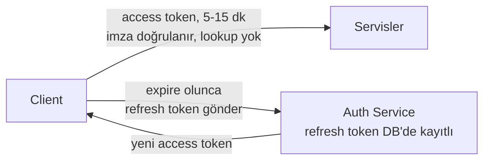
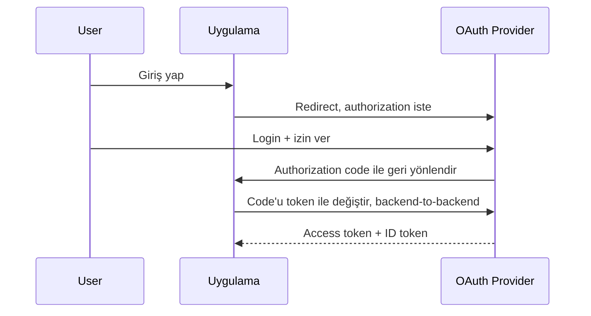

  
Kullanıcıyı güvenli şekilde nasıl kimliklendiririz (session vs JWT, OAuth2/OIDC, secrets yönetimi) ve bir sistemi tasarlamaya başlamadan önce büyüklüğünü nasıl tahmin ederiz (back-of-envelope hesaplama)? İkisi görünüşte alakasız ama ortak bir paydaları var: ikisi de gerçek sayılarla düşünmeyi gerektiriyor.
 
> Bu yazıda ele alınanlar: session vs JWT trade-off'u ve hybrid (access + refresh token) pattern, brute-force koruması, OAuth2/OIDC'nin authorization code flow'u, secrets yönetimi temelleri ve back-of-envelope QPS/storage hesaplama.
{: .prompt-info }
 
## 1. Authentication State: Session vs JWT
 
Stateless servisler, session bilgisini Redis gibi paylaşımlı bir katmana taşımalı. Fakat "session mi JWT mi" sorusu bundan biraz farklı, asıl fark **invalidation** kolaylığında.
 
### Session-based
 
- Sunucu session state'ini tutar (DB veya Redis), client sadece bir session ID (cookie) taşır.
- **Invalidation kolay:** kaydı sil, session anında geçersiz olur.
- Her istekte bir lookup(id arama) gerekir. "Instance stateless kalsın" prensibi "state hiç olmasın" demek değildir, state paylaşımlı katmanda yaşamaya devam eder.

### JWT
 
- Token kendi içinde claim'leri (user id, roller, expiry) taşır, sunucu tarafından imzalanır.
- Doğrulamak için lookup gerekmez, sadece imza kontrol edilir. Cache örneği olarak "auth sisteminde public key/jwks bilgisi" tam olarak burada devreye giriyor: doğrulayan servis imzalayanın public key'ini cache'ler, her istekte auth servisine gitmez.
- **Zayıf nokta: invalidation zor.** Token expire olana kadar geçerlidir. Kullanıcı çıkış yaptığında ya da token çalındığında "iptal ettim" demek için ekstra bir mekanizma (blocklist) gerekir, bu da JWT'nin kaçınmaya çalıştığı state'i geri getirir.

> "Kullanıcı çıkış yaptı, JWT'yi client'tan sildim, güvendeyim" yaygın bir yanılgıdır. Token hâlâ geçerlidir; biri onu ele geçirdiyse expire olana kadar kullanabilir. Kısa expiry süresi veya bir revocation mekanizması olmadan JWT gerçek bir invalidation garantisi vermez.
{: .prompt-warning }
 
### Pratikte: Hybrid (access + refresh token)
 
Çoğu modern sistem ikisini birleştirir: kısa ömürlü, 5-15 dakikalık JWT access token + uzun ömürlü, DB'de kayıtlı, iptal edilebilir refresh token.
 

 
Bu, iki dünyanın da iyi tarafını alır: çoğu istek hızlı (lookup yok), ama refresh token üzerinden gerçek bir revocation noktası var.
 
|                                         | Session        | JWT                         | Hybrid                         |
| --------------------------------------- | -------------- | --------------------------- | ------------------------------ |
| Invalidation                            | Anında         | Zor, expire'a kadar         | Refresh token iptal edilebilir |
| Her istekte lookup                      | Var            | Yok                         | Access token için yok          |
| Trust boundary'ler arası taşınabilirlik | Zor            | Kolay                       | Kolay                          |
| Tipik kullanım                          | Klasik web app | Servisler arası iç iletişim | Modern web/mobile API          |
 
## 2. Brute-Force Koruması
 
Rate limiting'in en somut uygulama alanlarından biri login endpoint'i, ama genel API rate limiting'den farklı üç nokta var:
 
- **Per-account VE per-IP limit gerekir.** Sadece IP bazlı limit koyarsak, saldırgan IP'sini rotate edip tek bir hesabı hedefleyebilir. Sadece hesap bazlı limit koyarsak, bir IP'den binlerce farklı hesap denenebilir (credential stuffing).
- **Hata mesajı bilgi sızdırmamalı.** "Kullanıcı bulunamadı" ile "şifre yanlış" farklı mesajlarsa, saldırgan hangi email'lerin sistemde kayıtlı olduğunu tespit edebilir. İkisi için de aynı genel mesaj dönülmeli: "email veya şifre hatalı."
- **Hard lockout dikkatli kullanılmalı.** N başarısız denemeden sonra hesabı tamamen kilitlemek, saldırganın kasıtlı olarak başka birinin hesabını kilitlemesine izin verir. Genelde daha iyi yaklaşım: artan gecikme (retry backoff'un sunucu tarafındaki eşdeğeri) veya CAPTCHA.

## 3. OAuth2 / OIDC: Delegated Authorization
 
OAuth2'nin çözdüğü problem: bir uygulamanın, kullanıcının şifresini hiç görmeden, kullanıcı adına belirli işlemler yapabilmesi, "Google ile giriş yap" ya da üçüncü parti bir uygulamanın Drive dosyalarına erişmesi gibi.
 
**OAuth2 vs OIDC karışıklığı:** OAuth2 *authorization* içindir: "bu uygulama benim adıma X yapabilir mi". OIDC (OpenID Connect), OAuth2'nin üzerine inşa edilir ve *authentication* ekler: "bu kullanıcı gerçekten kim". Bir uygulama sadece kullanıcı girişi istiyorsa OIDC'ye ihtiyacı var; kullanıcı adına bir API çağırmak istiyorsa OAuth2 scope'larına.
 
En yaygın akış, **authorization code flow**:
 

 
Kritik nokta: code-to-token değişimi backend-to-backend yapılır, token hiçbir zaman browser URL'inde görünmez.
 
> Token exchange, PKCE, redirect URI doğrulama gibi detaylarda küçük bir hata ciddi bir güvenlik açığına dönüşebilir. Olgun bir kütüphane veya identity provider (Auth0, Okta, Keycloak, Google/Microsoft identity platform) kullanmak gerekir.
{: .prompt-tip }
 
## 4. Secrets Management
 
Kısa ama gözden kaçırılan bir konu:
 
- Secret'ları koda veya git'e commitlenen config dosyalarına hardcode etme.
- Secrets manager kullan (Vault, AWS Secrets Manager vb.) veya en azından deploy zamanı enjekte edilen environment variable.
- **Least privilege:** her servis sadece ihtiyacı olan secret'a erişsin, tek bir paylaşılan "god credential" seti olmasın.
- Sızıntı şüphesi varsa rotate et, "muhtemelen bir şey olmadı" varsayımıyla beklemek yanlış tercih.

## 5. Back-of-Envelope Estimation
 
Sistem tasarımında akılda tutulması gereken genelde budur: "Kaç kullanıcı, ne kadar veri, ne kadar trafik?" Kesin sayı değil, büyüklük mertebesi düşünülmeli.
 
### Bilinmesi gereken sayılar
 
| İşlem                                  | Yaklaşık süre |
| -------------------------------------- | ------------- |
| RAM erişimi                            | ~100 ns       |
| SSD random read                        | ~100 μs       |
| Aynı datacenter içi network round-trip | ~0.5 ms       |
| Disk seek, mekanik                     | ~10 ms        |
| Cross-region network round-trip        | ~100-150 ms   |
 
Bu tablo ezbere değil, oran olarak akılda kalmalı: RAM, SSD'den ~1000x hızlı; aynı datacenter, cross-region'dan ~200x hızlı. Cache kararları da aslında bu farklardan besleniyor.
 
### Pratik çerçeve
 
1. Kullanıcı/trafik varsayımı yap.
2. Ortalama QPS hesapla, peak için 2-5x çarp.
3. Kayıt boyutunu tahmin et, toplam veri hacmini hesapla.
4. Replication/backup faktörünü ekle.
5. Sonucu yuvarla, kesin hesap değil, mertebe önemli.

### Örnek: Ödeme sistemi
 
- Varsayım: 5M günlük aktif kullanıcı, kullanıcı başına günde ortalama 0.5 ödeme işlemi.
- Günlük işlem: 5M × 0.5 = 2.5M işlem/gün
- Ortalama QPS: 2.5M / 86.400 ≈ 29 QPS
- Peak QPS, 3x varsayımıyla: ~87 QPS
- Kayıt boyutu: ~1 KB/işlem
- Günlük veri: 2.5M × 1 KB ≈ 2.5 GB/gün
- Yıllık veri, 3x replication ile: 2.5 GB × 365 × 3 ≈ 2.7 TB/yıl

Bu sayılar mimari kararı doğrudan etkiliyor: 87 QPS tek bir güçlü Postgres instance'ı için sorun değil, sharding'e muhtemelen bu ölçekte ihtiyaç yok. Ama kullanıcı sayısı 50x büyürse (250M günlük kullanıcı), aynı hesap ~4.350 QPS peak'e çıkar ve sharding gerçek bir gereksinim haline gelir.
 
## Sık Yapılan Hatalar
 
1. **JWT'yi "sildim, iptal oldu" sanmak**: token expire olana kadar geçerliliğini korur, revocation mekanizması olmadan risk devam eder.
2. **Login rate limiting'i sadece IP bazlı yapmak**: credential stuffing saldırılarına açık kalır.
3. **"Kullanıcı bulunamadı" / "şifre yanlış" gibi farklı hata mesajları dönmek**: enumeration'a izin verir.
4. **OAuth2'yi sıfırdan implemente etmeye çalışmak**: PKCE, redirect URI doğrulama gibi detaylarda küçük hatalar ciddi açık yaratır.
5. **Secret'ları koda hardcode etmek** veya tek bir paylaşılan credential seti kullanmak.
6. **Back-of-envelope hesabı atlayıp direkt "en ölçeklenebilir" mimariyi kurmak**: 100 QPS'lik bir sistem için sharding kurmak gereksiz karmaşıklık, sadece gecikme ve operasyon maliyeti ekler.
