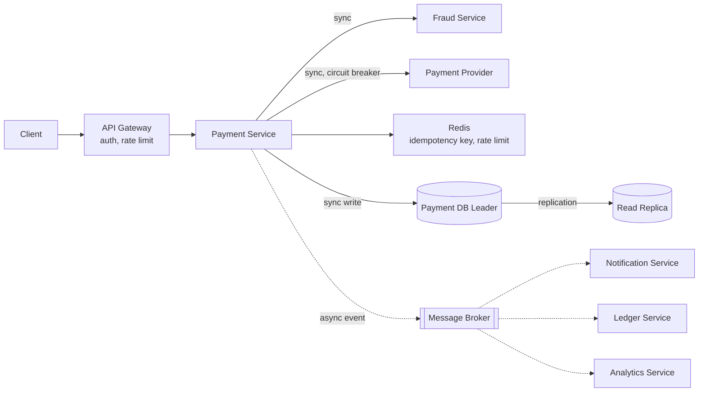
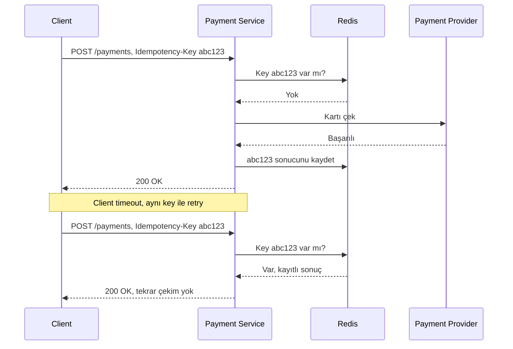

 
Vaka çalışması: **ödeme sistemini uçtan uca tasarlıyoruz**, idempotency'den JWT'ye, sharding'den circuit breaker'a, tek bir tasarımda kullanarak.
 
Format klasik bir system design yolunu takip ediyor: gereksinimler → kapasite tahmini → yüksek seviye mimari → kritik kararlar → ölçeklendiğinde ne değişir.
 
> Bu yazıda: gereksinimler ve bilinçli kapsam dışı bırakmalar, back-of-envelope kapasite tahmini, tam mimari diyagramı, idempotency / consistency / circuit breaker / servis sınırları / auth üzerine yedi kritik tasarım kararı ve sistem 50x büyüdüğünde nelerin değişeceği.
{: .prompt-info }
 
## 1. Gereksinimler
 
**Fonksiyonel:**
 
- Kullanıcı bir ödeme başlatabilir (kart bilgisi + tutar).
- Kullanıcı kendi işlem geçmişini görüntüleyebilir.
- Bir işlem iade edilebilir.

**Bilinçli olarak kapsam dışı:** kart tokenization / PCI-DSS detayları, çoklu para birimi, split payment.
 
**Fonksiyonel olmayan:**
 
- Hiçbir işlem iki kez çekilmemeli, sistemin tek "asla" kuralı.
- Yazma yolu: consistency > availability. CAP çerçevesi burada net bir tarafta durur, gerekirse istek reddedilir, ama asla belirsiz veya duplicate bir durum kabul edilmez.
- Okuma yolu (işlem geçmişi): birkaç saniyelik gecikme kabul edilebilir.
- Her işlem sonradan denetlenebilir (audit) olmalı.

## 2. Kapasite Tahmini
 
5M günlük aktif kullanıcı, kullanıcı başına günde ortalama 0.5 ödeme → 2.5M işlem/gün → ~29 QPS ortalama yazma, ~87 QPS peak yazma, ~2.7 TB/yıl (3x replication ile).
 
Bu sadece yazma tarafı. Okuma tarafı ayrı bir hesap ister, kullanıcılar işlem geçmişini yazdıklarından çok daha sık kontrol eder.
 
- Varsayım: kullanıcı başına günde ortalama 3 "işlem geçmişi" görüntülemesi.
- Günlük okuma: 5M × 3 = 15M okuma/gün
- Ortalama QPS: 15M / 86.400 ≈ 174 QPS
- Peak QPS (3x): ~520 QPS

Okuma/yazma oranı kabaca 6:1. Bu oran tesadüfi bir detay değil, replication kararı doğrudan etkiliyor. Okumaları leader'dan follower'lara dağıtmak burada gerçek bir kazanç, çünkü okuma trafiği yazmanın altı katı.
 
## 3. Yüksek Seviye Mimari
 

 
Düz çizgiler sync, kesikli çizgiler async. Okuma trafiği (işlem geçmişi) Read Replica'ya gider, yazma trafiği (ödeme) her zaman Leader'a.
 
## 4. Kritik Tasarım Kararları
 
### 4.1 Idempotency: Aynı ödeme iki kez çekilmesin
 
Idempotency key pattern'ini doğrudan uyguluyoruz. Client her ödeme isteğinde bir `Idempotency-Key` header'ı gönderir; sunucu bu key'i Redis'te tutar.
 

 
Key'in TTL'i makul bir süre aralığı olmalı (ör. 24 saat), TTL mantığı burada da geçerli: çok kısa olursa client'ın retry penceresini kaçırabiliriz, çok uzun olursa Redis'te gereksiz yer kaplar.
 
### 4.2 Consistency Modeli: Yazma Güçlü, Okuma Esnek
  
- **Yazma (ödeme):** her zaman DB Leader'a gider, hiçbir zaman eventual consistency kabul edilmez.
- **Okuma (işlem geçmişi):** Read Replica'dan gelir, birkaç saniyelik lag kabul edilebilir.
- **Bakiye sorgusu:** Uzun TTL'li bir cache burada yanlış bakiye gösterme riski taşır, finansal risktir, UX detayı değildir. Ya doğrudan Leader'dan okumalı (gecikmeyi kabul ederek), ya da kısa TTL + event-bazlı invalidation kullanmalı. "Her şeyi cache'le" yaklaşımı burada uygulanmaz.

### 4.3 Payment Provider Çağrısı: Retry, Circuit Breaker ve Belirsiz Timeout Problemi
 
Bottleneck analizini düşündüğümüzde provider çağrısının en kırılgan adım olduğunu söyleyebilriiz. Retry + backoff + circuit breaker üçlüsü burada uygulanır. Ama payment'a özgü bir incelik var.
 
> Provider çağrısı timeout olursa, ödemenin gerçekten çekilip çekilmediğini bilemeyiz, timeout, başarı ile başarısızlık arasında belirsiz bir durumdur. Kendi Idempotency-Key'imizi provider'a da geçmek şart: böylece retry olsa bile provider aynı işlemi tekrar çalıştırmaz, önceki sonucu döner. Provider bunu desteklemiyorsa, körlemesine retry atmak yerine provider'ın "işlem durumu sorgula" endpoint'ini kullanmalıyız.
{: .prompt-danger }
 
Bu, idempotency'nin neden tek başına yeterli olmadığını gösteriyor, client-server arasındaki idempotency ile server-provider arasındaki idempotency iki ayrı problem.
 
### 4.4 Async Fan-out: Notification, Ledger, Analytics
 
DB write commit olduktan sonra `PaymentAuthorized` event'i yayınlanır. At-least-once delivery + idempotent consumer prensibi burada da geçerli: Ledger servisi de kendi tarafında "bu event ID'sini daha önce işledim mi" kontrolü yapmalı. Ledger, "parasal kayıtlar → SQL" kuralına uyar ve payment DB'sinden ayrı bir servistir, farklı sorgu paternleri (muhasebe/audit) var, payment'ın kendi transactional yükünü etkilememeli.
 
### 4.5 Saga Katılımcısı Olarak Payment Service
 
Bu servis genelde daha büyük bir akışın (sipariş → ödeme → stok → kargo) tek adımıdır. Saga pattern'i tam olarak bu servisin sınırları dışında yaşar, ama payment servisinin API'si buna hazır olmalı: bir **refund endpoint'i**, sipariş akışındaki compensating transaction olarak kullanılabilmeli.
 
### 4.6 Servis Sınırları: Fraud ve Ledger Neden Ayrı
  
- **Fraud ayrı** çünkü farklı scaling profili var (ML tabanlı, potansiyel olarak daha ağır compute), genelde farklı bir ekip sahiplenir, kuralları payment'ın core mantığından çok daha sık değişir.
- **Ledger ayrı** çünkü tüketicileri farklı (muhasebe/audit), payment'ın kendi yazma yükünden izole olması gerekiyor.
- Payment → Fraud tek bir senkron çağrı, üç-dört round-trip değil. Distributed monolith uyarısına takılmıyor.

### 4.7 Auth: Client-Facing vs Servisler Arası
 
- **Client → Gateway:** hybrid pattern, kısa ömürlü JWT access token + iptal edilebilir refresh token.
- **Payment → Fraud, Payment → Provider:** servisler arası çağrılarda kullanıcı JWT'si taşınmaz; API key veya mTLS kullanılır. Least-privilege prensibi burada somutlaşır, Fraud servisinin payment DB'sine erişimi yok, sadece kendi API'sine.

## 5. Ölçeklendiğinde Ne Değişir?
  
| Bileşen        | Şu an, ~87 QPS peak                      | 50x ölçek, ~4.350 QPS peak                                        |
| -------------- | ---------------------------------------- | ----------------------------------------------------------------- |
| Payment DB     | Tek leader + birkaç read replica yeterli | Sharding gerekli, shard key: `user_id`                            |
| Redis          | Tek instance yeterli                     | Redis Cluster'a geçiş                                             |
| Fraud check    | Her zaman senkron                        | Düşük riskli işlemler için asenkron, riskli olanlar senkron kalır |
| Trace sampling | %100 mümkün                              | %1-5 örnekleme + hata/yavaş istekler her zaman %100               |
 
En ilginç satır fraud check. Şu anki ölçekte "her ödeme için senkron fraud kontrolü" maliyeti düşük. 50x'te bu, gecikmenin en büyük kaynağı haline gelir. Burada gerçek bir trade-off var: düşük riskli işlemleri (ör. küçük tutar + güvenilir geçmişi olan kullanıcı) hızlı bir kural motoruyla senkron geçir, riskli görünenleri tam fraud kontrolüne yönlendir. Bu, "her şey strongly consistent/senkron olmalı" uç noktasından bilinçli bir sapma.
 
## Sık Yapılan Hatalar
 
1. **Provider çağrısını kendi idempotency key'imiz olmadan retry etmek**: timeout sonrası çift çekim riski.
2. **Bakiye ekranını uzun TTL ile cache'leyip invalidation'ı ihmal etmek**: Gerçek bir tasarım kararı olarak karşımıza çıkabilir.
3. **Fraud servisini payment DB'sine direkt erişimle tasarlamak**: servis sınırını bulanıklaştırır, ayrı ölçekleme/deploy imkanını kaybettirir.
4. **Ledger'ı payment write'ının senkron bir parçası yapmak**: ana ödeme akışını gereksiz yere yavaşlatır ve kırılganlaştırır.
5. **Tüm trafiği aynı consistency seviyesinde tasarlamak**: yazma ve okuma yolunun farklı gereksinimleri olduğunu göz ardı etmek.
6. **87 QPS için sharding/microservice kompleksitesi kurmak**: mevcut ölçekte gereksiz; tüm tasarım kararlarını en başından uygulamaya çalışmak, over-engineering'in kendisidir.

## Özet
 
Scalability ve CAP, replication/sharding/idempotency, rate limiting/gateway/observability, sync-async/Saga/servis sınırları, auth/estimation.
 
Asıl mesaj şu: bu kavramların hiçbiri izole bir "best practice" değil. Her biri belirli bir gereksinime verilen somut bir cevap, aynı işlem iki kez çekilmesin, bakiye doğru gösterilsin, provider yavaşladığında sistem çökmesin. İyi bir sistem tasarımı, bu cevapların listesi değil, hangi sorunun hangi cevabı gerektirdiğini görebilmek.
 